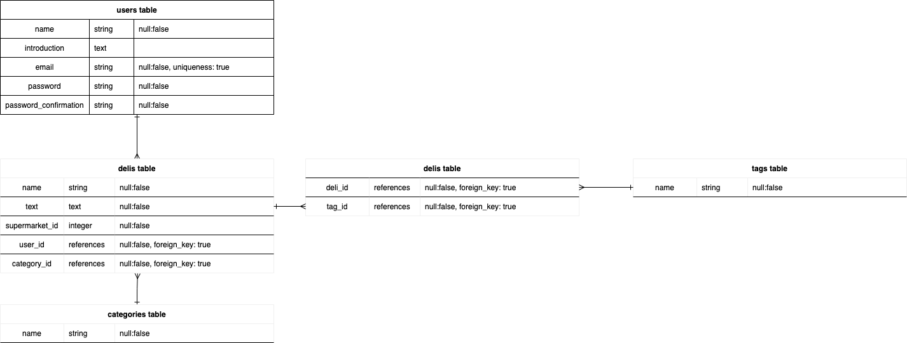

# Deli Share

## 本番環境URL
http://35.74.57.140/

## アプリケーション概要
　このアプリケーションでは、スーパーマーケットやコンビニエンスストアで購入した惣菜を共有することができます。投稿には、タイトル、説明文、カテゴリーや購入した店舗の選択、画像投稿、タグの入力が必要です。記事を投稿した本人は投稿を編集したり削除したりすることが可能です。トップページや投稿されている記事の閲覧はログインの有無に関わらず可能です。 
　このアプリケーションには、検索機能がついています。ヘッダーにある検索フォームにキーワードを入力すると、タイトル・本文・タグの内容でヒットする投稿を検索することができます。また、矢印をクリックするとカテゴリー/スーパーマーケットを選択するプルダウンがあります。各プルダウンで選択後に検索すると、該当の投稿を探すことができます。 

## テスト用アカウント
Email: sample0001@sample0001.com 
PASS: sample0001

## 利用方法
- ログイン方法
　TOPページに遷移すると、投稿一覧が表示されています。ヘッダーにログインボタンがあるため、上記アカウントを利用しログインをしてください。
- 新規投稿機能
　ログイン後再びTOPページに遷移するとNew Deliのリンクボタンがあります。ボタンを押すと新規投稿画面に遷移するため、各項目を入力してください。画像はファイルを選択ボタンから投稿できます。タグは、,で区切ることで複数のタグ選択が可能です。すべてのフォームの入力が完了し、投稿するボタンを押すと投稿が完了します。
- 投稿編集機能
　商品詳細ページから編集ボタンを押すと投稿の編集が可能です。この編集ボタンは、投稿者本人以外には見えないようになっています。 
　編集画面に遷移すると、各フォームにすでに投稿済みの各データが入力されています。編集したい内容を、該当するフォームに入力してください。画像は、現状編集画面に遷移するとリセットされてしまうため、再度アップロードをお願いします。
- 削除機能
　商品詳細ページから削除ボタンをすると、削除確認画面に遷移します。削除するボタンを押すと投稿を削除することが可能です。 
　削除が完了すると、削除完了画面に遷移します。TOPページへ戻るボタンを押すと、TOPページに遷移することが可能です。
- 検索機能
　ヘッダーに、検索フォームを設置しています。検索フォームにキーワードを入れると、投稿のタイトル、
本文、タグに該当するキーワードがある投稿を検索することができます。また、▼ボタンをクリックするとカテゴリー/スーパーマーケットを選択できるプルダウンが表示されます。検索したいカテゴリーやスーパーマーケットを選択すると、それらを設定している投稿を検索することが可能です。
- ユーザー管理機能
　ログイン後に表示されるヘッダーにあるマイページボタンをクリックすると、ユーザー管理画面に遷移します。プロフィールを編集ボタンを押すと、ユーザー情報の編集画面に遷移し、ユーザー名の変更や自己紹介文の投稿、ユーザーアイコンを設定することができます。保存するボタンを押すと、投稿された内容が反映されます。アイコン画像を設定した場合は、投稿一覧画面や投稿詳細画面にアイコンが表示されるようになります。 
　また、自分以外のユーザーの情報は、投稿一覧画面及び投稿詳細画面に表示されているユーザー名をクリックすることでユーザー詳細画面に遷移することができます。ただし、本人以外はユーザー情報を編集することができないため、プロフィールを編集ボタンは表示されません。

## 目指した課題解決
　このアプリケーションは、いつも買っている惣菜に飽きた人や、毎日の献立に悩む人が情報収集のために利用することを目的としています。 
　アプリケーションを開発するきっかけは、自分自身の過去の経験からです。私は社会人になってから約2年間、月に2〜3回ほど出張に出る生活を送っていました。平日はほぼ外食のため、出張先の夕食はスーパーやコンビニの惣菜で済ませることが大半でした。その時に買っていた惣菜はほぼ変わり映えのしない食品をローテーションで食べていました。 
　しかし、今やスーパーなどの惣菜はTVやネット記事で特集されるほど各店舗が力を入れて生産しています。地方のスーパーに足を運んだら、その地の名産惣菜を食べることも束の間の楽しみの一つになるかもしれません。 
　このようなきっかけからこのアプリケーションを開発しようと考えました。アプリケーションのペルソナは、20代後半の営業職の女性を設定しています。私のように、出張先の食事に悩む方、また、一人暮らしの食事の参考にするために利用するアプリケーションを目指し、爽やかな色彩をメインに使用しています。
しかし、このアプリケーションは日々の献立に悩む主婦の方にも利用しやすいよう、アプリケーション上ではわかりやすい表現（日本語表記をメインにするなど）を心がけました。
　
## 洗い出した要件
- タグ付け機能
　ユーザーが任意の単語をタグとして登録できる機能。投稿検索の際に、肉、魚などわかりやすい単語を検索することで投稿を探しやすくすることを目的としています。
- 投稿検索機能
　ユーザーが気になるワードや、設定されたスーパーごとの投稿を検索する機能。自分が閲覧したい投稿を探しやすくすることが目的。
- 投稿削除確認機能
　自分が投稿した記事を削除するための機能。削除前に削除確認をすることで、間違って削除することを防ぐことが目的。
- SNSアカウントを利用したログイン機能
　より多くのユーザーが利用しやすくなるよう、SNSアカウントを利用したログイン機能を実装。アカウント作成のハードルを下げることを目的としています。
- SNSへの共有機能
　自分が投稿した記事や、他のユーザーの気になる記事を他のSNSに投稿する機能。利用者の多いSNSで共有することで、より多くの人に閲覧してもらうことを目的としています。
- コメント機能
　コメント機能を通して、ユーザー同士のコミュニケーションを図ることを目的としています。
- いいね機能
　コメント機能同様、ユーザー同士のコミュニケーションツールの一環として使用することが目的。

## 実装した機能について
- ログイン機能

- 新規投稿機能

- 投稿編集機能

- 投稿削除機能（確認〜削除）

- 投稿検索機能
* キーワード検索

* カテゴリー検索

* スーパーマーケット検索

## 実装予定の機能
- SNSアカウントでのログイン機能
- SNSへの共有機能
- いいね機能

## データベース設計

## ローカルでの動作方法
$ git clone https://github.com/programmingnuoh/delishare.git  
$ cd delishare  
$ bundle install  
$ rails db:create  
$ rails db:migrate  
$ http://localhost:3000  